# 使用云开发搭建全网2048小游戏

一个简单的2048小游戏，如何通过云开发的巧妙接入，变成可以可以记录自己历史最高战绩和全网战绩的网络小游戏，快来体验尝试吧
使用云开发的数据库、云函数，登录验证使用匿名登录。

[Zira冠宇](https://github.com/wasfzxt)

---
## 创建云开发环境
>> 3min

##### 一、新建【按量计费云开发环境】
进入[腾讯云云开发控制台-创建环境](https://console.cloud.tencent.com/tcb/env/index?action=CreateEnv)，选择按量计费环境，环境名称可以自定义设置。如果已有按量计费环境则可以跳到下一步。
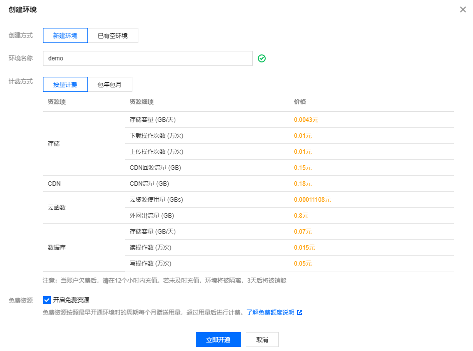

##### 二、开通静态网站托管服务
进入[进入静态网站控制页](https://console.cloud.tencent.com/tcb/hosting/index),选择刚才创建好的环境，开通静态网站托管服务。


##### 三、创建数据库
进入[数据库控制页](https://console.cloud.tencent.com/tcb/database)，添加1个集合；集合名字为2048
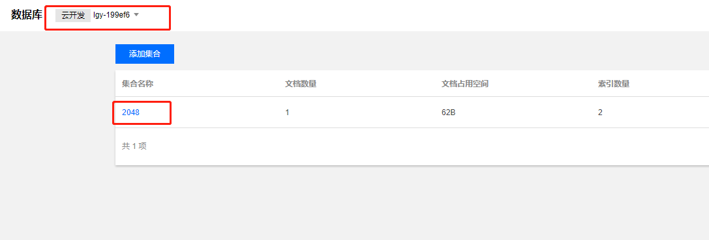

##### 四、开启匿名登录
进入[环境设置页-登录授权](https://console.cloud.tencent.com/tcb/env/login)的登录方式中，勾选匿名登录
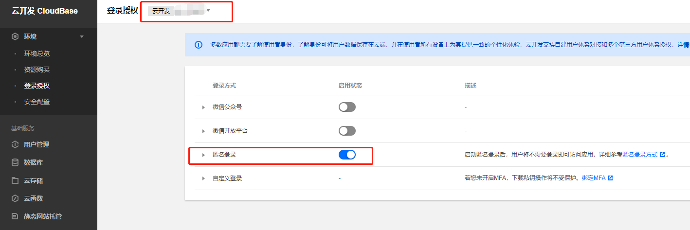

---
## 下载并部署源码
>> 6min

##### 一、下载源码
访问[github仓库](https://github.com/TCloudBase/WEB-2048),下载源码到本地。源码项目目录如下：
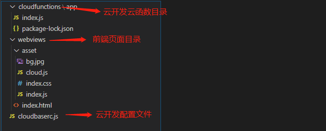

##### 二、本地运行
将项目webviews/index.html以http的形式运行，可使用IDE工具vscode，hbuilder。在浏览器的地址栏中确定url地址，比如例子中，域名地址为127.0.0.1:5500
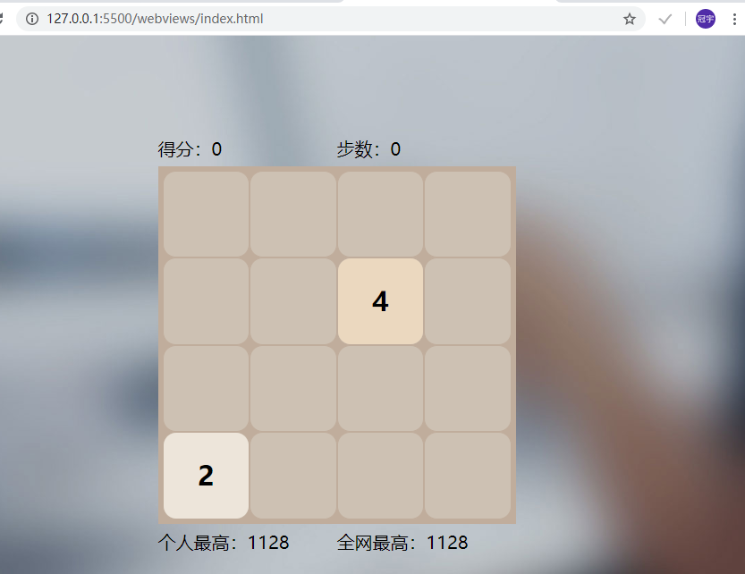

##### 四、配置本地开发的安全域名
如果想在本地开发，必须要在云开发中配置本地的安全域名才能够正常调试开发。
进入[环境设置页-安全配置](https://console.cloud.tencent.com/tcb/env/safety),配置WEB安全域名，在这里以127.0.0.1:5500举例，请按照自己的实际域名配置


##### 五、填写云开发环境ID到项目中
云开发是通过环境ID来判定与特定环境进行数据通信的，所以在项目中要配置所有的相关环境ID为自己的ID。（建议熟练后，使用配置文件形式来配置）
- 进入[环境总览页](https://console.cloud.tencent.com/tcb/env/overview),复制获取云开发环境ID。
  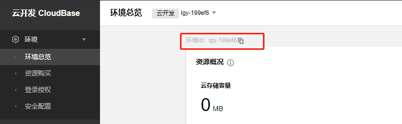
- 打开项目目录，将以下文件中标注有【云开发环境ID】处替换成自己的云开发环境ID
    - cloudfunctions/app/index.js 第4行
        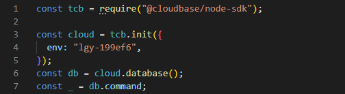

    - cloudbaserc.js 第2行
        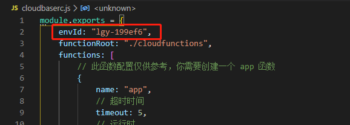

    - webviews/asset下的cloud.js文件，第2行
        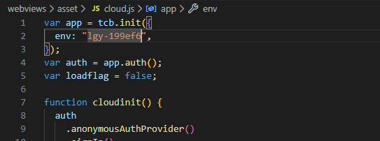

---
## 本地项目开发
>> 10min

##### 一、说明
webviews/asset下的index.js是本地2048有关的操作，包括2\4随机生成，合并相同数字，上下左右监听，移动端滑动监听等。
而cloud.js是外挂的云开发的相关支持。

关于cloud.js内的代码逻辑，请参照云开发文档学习和理解。

##### 二、编写代码，开启历史记录和全网分数
在index.html的script标签中新增如下代码：
```js
    cloudinit();
```
此代码调用cloud.js的cloudinit函数，进行匿名登录，然后发起云函数的请求，获取全网最高分数和历史最高分数。

关于app云函数的源码如下（不需要编写，已有）：
```js
const tcb = require("@cloudbase/node-sdk");

const cloud = tcb.init({
  env: "lgy-199ef6",
});
const db = cloud.database();
const _ = db.command;
exports.main = async (event, context) => {
  let res = {};
  //获取用户数据
  const auth = cloud.auth().getUserInfo();
  //获取用户的uid
  const uid = auth.uid;
  if (uid != null) {
    //如果uid不为空，则尝试在2048数据库中获取文档
    const result = (
      await db
        .collection("2048")
        .where({
          _id: uid,
        })
        .get()
    ).data;
    if (result.length == 0) {
        //如果没有文档，则新增，以uid为文档的_id，默认分数为0
      await db.collection("2048").add({
        _id: uid,
        score: 0,
      });
    }
    if (event.score != null && result[0].score < event.score) {
        //如果传入了分数，并且分数比数据库中的高，则更新分数
      await db.collection("2048").doc(uid).update({
        score: event.score,
      });
      res.myscore = event.score;
    } else {
        //如果没有分数，或者分数没数据库高，则返回数据库的分数或者不存在的0
      res.myscore = result.length != 0 ? result[0].score : 0;
    }
    //获取整个数据库最高的分数
    const array = (
      await db.collection("2048").orderBy("score", "desc").limit(1).get()
    ).data;
    //整理返回数据
    res.netscore = array[0].score;
    res.code = 0;
  } else {
      //如果uid为空，则为非法的，返回404
    res.code = 404;
  }
  return res;
};

```

---
## 配置云函数
>> 3min

##### 一、安装依赖
在cloudfunctions/gobangdelete下右键在终端打开
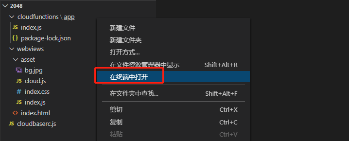

在终端中输入以下命令，安装依赖：
```bash
    npm i @cloudbase/node-sdk
```

##### 三、部署云函数
在cloudfunctions/app目录，右键执行部署云函数（上传全部文件）。在一开始使用时会出现登录，按照提示完成登录步骤即可。【如果没有此选项，请前往[云开发VSCODE插件](https://docs.cloudbase.net/vscode/intro.html)安装并学习使用】
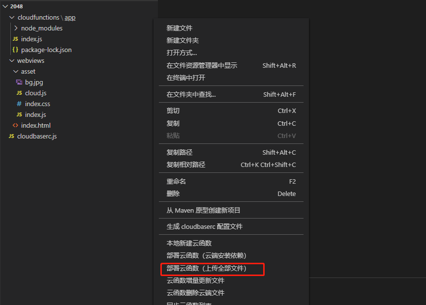

---
## 本地测试项目可用性
>> 5min

##### 一、重新启动项目，进入页面
使用键盘上下左右键进行相同数字合并，最终到无法移动任何数字结束
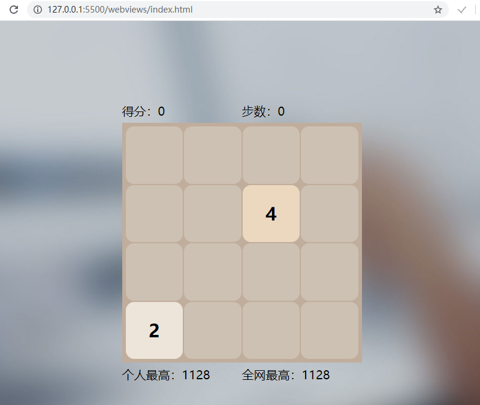

结束后，会在底部更新历史最高分和全网最高分。
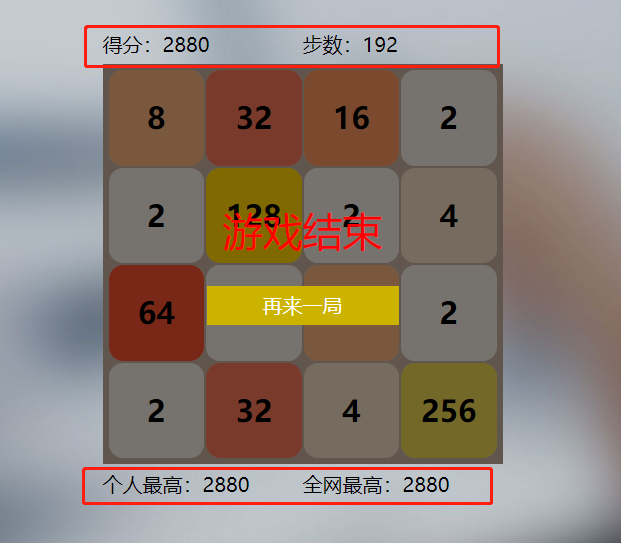

##### 三、总结
如果本地验证都没有问题，则配置没有问题。如果出现任何一个步骤的错误提示，则F12控制台查看并排除原因，一般是环境ID写错错误导致。

---
## 上传至静态存储
>> 2min

将本地验证成功的项目上传至静态存储中。在webviews目录右键点击，上传至静态网站根目录
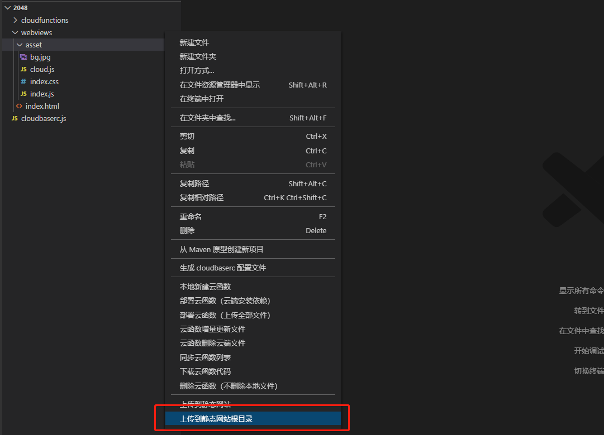

进入[云开发静态网站管理页](https://console.cloud.tencent.com/tcb/hosting/index),可以看到已上传的项目。
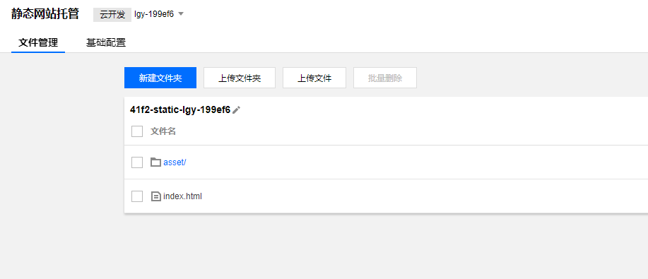

进入[云开发静态网站设置页](https://console.cloud.tencent.com/tcb/hosting/index?tabId=config),访问默认域名网址即可进入线上项目

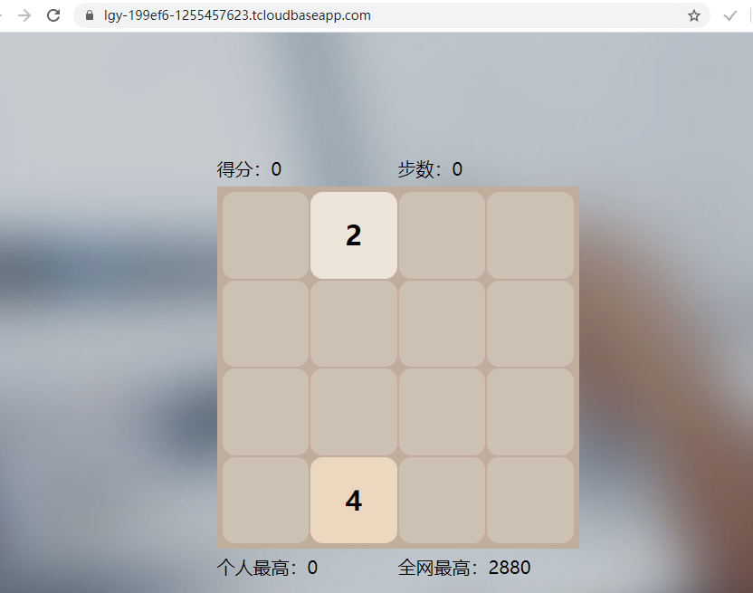

---
## 关于自定义域名和网站对外开放
>> 1min

云开发提供了完备的web端资源服务，但是一个对外公开使用的web项目需要有自己的备案域名，需要受到监管。所以，在正式对外推出之前，需要将云开发提供的默认域名替换成自己已经备案的域名

- 前往[云开发静态网站设置页](https://console.cloud.tencent.com/tcb/hosting/index?tabId=config)，在【域名信息】下点击添加域名按钮，填写已经备案的域名。域名需要配有SSL证书，腾讯云下域名会自动监测证书；如果是非腾讯云旗下域名，则需要上传SSL证书。
- 需要等待域名添加状态为【已启动】后，才可以去域名解析中配置CNAME。
- 前往[环境设置页-安全配置](https://console.cloud.tencent.com/tcb/env/safety)，在WEB安全域名中删除云开发的默认域名，只保留自定义域名。
- cloudfunctions/functions/getFile/index.js的AllowOriginList数组中，将默认域名更换成自定义域名，保存更新。
